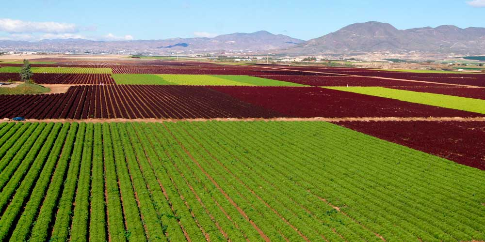

<!-- Configuramos las opciones globales y cargamos las librerías -->
```{r setup, include=FALSE}
knitr::opts_chunk$set(echo = TRUE) 
```

```{r cargar_librerías, echo=FALSE, message=FALSE, warning=FALSE}
library(dplyr)
library(ggplot2)
library(knitr)
library(kableExtra)
```

# [INTRODUCCIÓN]{style="color: darkred;"}

Existe gran diversidad de malas hierbas en los sistemas agrícolas europeos, lo cual ofrece un escenario ideal para comprender tanto el funcionamiento de los agroecosistemas como los desafíos de la conservación de la biodiversidad vegetal. Aunque estas especies suelen considerarse problemáticas desde un punto de vista productivo, su presencia, distribución y estado de conservación están estrechamente ligados a muchos factores distintos, (ecológicos, climáticos y territoriales) lo que las convierte en un objeto de estudio relevante desde una perspectiva ambiental.

Por tanto, este trabajo consiste en el análisis de un conjunto de datos de carácter taxonómico y ecológico que recoge información sobre especies de malas hierbas registradas en Francia. A partir de este dataset, se pretende obtener una visión general de la composición de las especies y su procedencia biogeográfica, así como su estado de conservación, sentando las bases para un análisis descriptivo y estadístico que permita explorar posibles patrones y diferencias entre regiones.

<!-- Para pegar una foto y que este alineada usamos ese código -->

<p align="center">



</p>

## Los datos

<!-- Carga del archivo CSV -->
```{r cargar_datos, echo=FALSE}
library(readr)
Data <- read.csv("tax.discoweed_18Dec2017_zenodo.csv")
```

El conjunto de datos utilizado en este proyecto procede de [**Kaggle**](https://www.kaggle.com/datasets/thedevastator/weed-plant-taxonomy-in-france-and-uk?resource=download), donde se recopila **información taxonómica** y de **conservación de especies** de malas hierbas registradas en Francia y Reino Unido. El dataset original fue generado a partir de bases de datos botánicas oficiales y contiene listados de especies, clasificación taxonómica, región biogeográfica a la que pertenecen, y su categoría de conservación en ambos países.

Este tipo de información resulta **especialmente valiosa** para estudios ecológicos, ya que permite **comparar** patrones de biodiversidad, **analizar** las diferencias en la gestión ambiental entre regiones y **detectar** posibles riesgos para la conservación de especies vegetales.


<!-- Para obtener una primera visión del dataset mostramos las primeras observaciones -->
```{r vista_inicial_datos, echo=FALSE}
knitr::kable(head(Data, 6),align = 'c', caption = "Vista inicial de las primeras 6 filas del dataset") %>%
  kable_styling(full_width = FALSE, position = "center") %>%
  scroll_box(width = "900px", height = "450px") #Muestra las primeras filas del dataset en una tabla desplazable (scroll)
```

La tabla contiene `r nrow(Data)` filas y `r ncol(Data)` columnas.

Esto significa que disponemos de **`r nrow(Data)` observaciones** sobre las cuales se pueden analizar el comportamiento de las **`r ncol(Data)`** variables registradas.

## Descripción de las variables

A continuación se presenta una descripción resumida de todas las variables incluidas en el conjunto de datos. Se indica el tipo y el significado ecológico o taxonómico de cada una [^1].

[^1]: <https://www.kaggle.com/datasets/thedevastator/weed-plant-taxonomy-in-france-and-uk?resource=download>

<!-- Definimos un tibble mediante tribble con la descripción de todas las variables (manualmente) -->
```{r descripción_todas_las_variables, echo=FALSE, message=FALSE, warning=FALSE}
Variables <- tibble::tribble(
  ~Variable, ~Tipo, ~Descripcion,
  "taxref10.CD_REF", "Integer", "Código de referencia taxonómica (TAXREF) de la especie.",
  "binome.discoweed", "String", "Nombre binomial de la especie (género + especie).",
  "family", "String", "Familia botánica de la especie.",
  "taxo", "String", "Rango taxonómico registrado (p. ej: especie, subespecie, etc.).",
  "binome.discoweed.noinfra", "String", "Nombre binomial sin rango infraespecífico.",
  "taxref10.CD_REF.infra", "Integer", "Código TAXREF con rango infraespecífico.",
  "jauzein", "Boolean", "Presencia en la base de datos Jauzein (TRUE/FALSE).",
  "za", "Boolean", "Presencia en la base de datos ZA (TRUE/FALSE).",
  "biovigilance", "Boolean", "Presencia en la base de datos Biovigilance (TRUE/FALSE).",
  "fse", "Boolean", "Presencia en la base de datos FSE (TRUE/FALSE).",
  "farmbio", "Boolean", "Presencia en la base de datos Farmbio (TRUE/FALSE).",
  "cambecedes", "Boolean", "Presencia en la base de datos Cambecedes (TRUE/FALSE).",
  "lifeform", "String", "Forma de vida (característica ecológica).",
  "biogeo", "String", "Zona biogeográfica asignada a la especie.",
  "red.FR", "String", "Estado/categoría en la Lista Roja para Francia.",
  "red.UK", "String", "Estado/categoría en la Lista Roja para Reino Unido.",
  "module", "Integer", "Grado dentro del módulo (within-module degree) en la red/estructura del dataset.")
```

<!-- Se muestra el tibble `Variables` como una tabla desplazable (scroll_box) para facilitar su lectura en el HTML -->
```{r tabla_de_variables, echo=FALSE, warning=FALSE, message=FALSE}
knitr::kable(Variables, caption = "Descripción de variables del dataset") %>%
  kable_styling(full_width = FALSE, position = "center") %>%
  scroll_box(width = "900px", height = "450px")
```

Para el trabajo hemos usado los paquetes : ggplot2[@ggplot22016], knitr [@knitr2015] y dplyr [@R-dplyr].

# [OBJETIVO DEL TRABAJO]{style="color: darkred;"}

El objetivo general de este trabajo es **analizar el conjunto de datos sobre malas hierbas registradas en Francia**, con el fin de obtener una visión estructurada de su composición taxonómica, ecológica y de conservación, así como **explorar posibles relaciones** entre la procedencia biogeográfica de las especies y su **estado de conservación**.

Para alcanzar este objetivo general, se plantean los siguientes **objetivos específicos**:

-   **Familiarizarnos con el dataset**, sus variables y su estructura.

-   **Realizar una descripción general** de las especies de malas hierbas en Francia.

-   **Examinar la distribución de las especies según sus zonas biogeográficas**, sin asumir aún ninguna relación.

-   **Analizar gráficamente** la distribución de las categorías de conservación.

-   **Aplicar técnicas estadísticas** para comprobar si existe relación entre biogeografía y estado de conservación.

-   **Interpretar los resultados**.

# [HIPÓTESIS]{style="color: darkred;"}

En este trabajo analizamos si el estado de conservación de las especies de malas hierbas varía en función de su procedencia biogeográfica. Para ello planteamos la siguiente hipótesis:

**Hipótesis nula: El estado de conservación de las especies de malas hierbas en Francia no está asociado a su zona biogeográfica.**

**Hipótesis alternativa: El estado de conservación de las especies de malas hierbas en Francia está asociado a su zona biogeográfica.**

Esta hipótesis es relevante desde una **perspectiva ecológica**, ya que las distintas zonas biogeográficas presentan condiciones climáticas, agrícolas y de manejo del territorio diferentes, lo que podría influir en la vulnerabilidad de las especies dentro del contexto francés.

<!-- Para pegar una foto y que este alineada usamos ese codigo -->

<p align="center">


</p>

# [ANALISIS ESTADÍSTICO]{style="color: darkred;"}

<!-- Seleccionamos las variables relevantes y filtramos los datos eliminando valores para el análisis estadístico -->
```{r datos_filtrados, echo=FALSE, warning=FALSE, message=FALSE}
Data_analisis <- Data %>%
  select(
    binome.discoweed,
    family,
    lifeform,
    biogeo,
    red.FR,
   ) %>% 
  filter(!is.na(biogeo), !is.na(red.FR)) # filter elimina las filas con valores NA en biogeo y red.FR para evitar problemas en el análisis
```

Para llevar a cabo el análisis estadístico, se realizó una **selección de las variables relevantes** del conjunto de datos original [^2]. Este proceso nos permitió **reducir la complejidad del dataset** y centrarnos únicamente en aquellas variables directamente relacionadas con los objetivos y la hipótesis planteada.

[^2]: Munoz, F., Fried, G., Armengot, L., Bourgeois, B., Bretagnolle, V., Chadoeuf, J., ... & Gaba, S. (2017). Database of weeds in cultivation fields of France and UK, with ecological and biogeographical information.

Se seleccionaron las variables necesarias para **analizar la relación entre la zona biogeográfica de las especies y su estado de conservación** en Francia.

A continuación, se muestra una tabla con las variables seleccionadas que se utilizarán en el análisis estadístico.

```{r tabla_datos_filtrados, echo=FALSE, warning=FALSE, message=FALSE}
Variables_analisis <- tibble::tribble(
  ~Variable, ~Descripcion,
  "binome.discoweed", "Nombre binomial de la especie.",
  "family", "Familia botánica a la que pertenece la especie.",
  "lifeform", "Forma de vida de la especie (característica ecológica).",
  "biogeo", "Zona biogeográfica de procedencia de la especie.",
  "red.FR", "Estado de conservación de la especie en Francia.")
```

```{r tabla_filtrados, echo=FALSE, warning=FALSE, message=FALSE}
knitr::kable(Variables_analisis,
      caption = "Tabla 1. Variables seleccionadas para el análisis estadístico") %>%
  kable_styling(full_width = TRUE, position = "center")
```

## Análisis descriptivo

El **análisis descriptivo** nos permitió caracterizar el conjunto de especies estudiadas y obtener una primera visión general de su composición.

En este apartado se describen las especies en función de su *familia botánica*, *forma de vida*, *zona biogeográfica* y *estado de conservación* en Francia.

Esto nos permite describir la situación general de conservación de las especies incluidas en el estudio, sin evaluar su relación con otras variables.

**Composición general**

En primer lugar, analizamos el número total de especies consideradas en el análisis y su diversidad taxonómica básica atendiendo al número de familias botánicas y zonas biogeográficas representadas.

<!-- Calculamos un resumen general del dataset, obteniendo el número de especies, familias botánicas y zonas biogeográficas -->
```{r resumen, echo=FALSE, warning=FALSE, message=FALSE}
Data_analisis %>%
summarise(
numero_especies = n_distinct(binome.discoweed),
numero_familias = n_distinct(family),
numero_zonas_biogeo = n_distinct(biogeo)) %>%
knitr::kable(caption = "Tabla 2.Resumen general del conjunto de datos") %>%
kable_styling(full_width = FALSE, position = "center")
```

Este resumen muestra que el conjunto de datos incluye un elevado número de especies pertenecientes a múltiples familias botánicas y procedentes de diversas zonas biogeográficas, lo que refleja una alta diversidad taxonómica dentro del grupo de malas hierbas consideradas en el estudio.

**Distribución por familias**

A continuación, examinamos la distribución de las especies según su familia botánica con el objetivo de identificar aquellas con mayor representación en el conjunto de datos.

```{r familias_distribución, echo=FALSE, warning=FALSE, message=FALSE}
Data_analisis %>%
count(family, sort = TRUE) %>% # count calcula el número de especies por familia y las ordena de mayor a menor frecuencia con sort 
head(10) %>%
knitr::kable(caption = "Tabla 3. Diez familias más representadas") %>%
kable_styling(full_width = TRUE, position = "center")
```

Observamos que unas pocas familias concentran la mayor proporción de especies, un patrón habitual dado que ciertas familias presentan una mayor capacidad de adaptación a ambientes agrícolas.

**Forma de vida de las especies**

La forma de vida es una característica clave para entender la estrategia de supervivencia de las especies en sistemas agrícolas.

```{r forma_vida, echo=FALSE, warning=FALSE, message=FALSE}
Data_analisis %>%
count(lifeform, sort = TRUE) %>%
knitr::kable(caption = "Tabla 4. Distribución de especies según su forma de vida") %>%
kable_styling(full_width = TRUE, position = "center")
```

La tabla muestra que predominan determinadas formas de vida típicas de **ambientes modificados**.

**Distribución por zonas biogeográficas**

Analizamos la procedencia biogeográfica de las especies incluidas en el estudio.

```{r biogeo, echo=FALSE, warning=FALSE, message=FALSE}
Data_analisis %>%
count(biogeo, sort = TRUE) %>%
head(8) %>% 
knitr::kable(caption = "Tabla 5. Distribución de especies por zona biogeográfica") %>%
kable_styling(full_width = TRUE, position = "center")
```

Esto nos permitió conocer cómo se distribuyen las especies entre las distintas regiones biogeográficas consideradas, aportando un contexto general para el análisis posterior.

**Estado de conservación en Francia**

Por último, se describió la distribución de las especies según su estado de conservación en cada país.

```{r conservaciónFR, echo=FALSE, warning=FALSE, message=FALSE}
Data_analisis %>%
count(red.FR, sort = TRUE) %>%
knitr::kable(caption = "Tabla 6. Estado de conservación de las especies en Francia") %>%
kable_styling(full_width = TRUE, position = "center")
```

## Análisis inferencial y gráfico

Con el objetivo de contrastar la hipótesis planteada, evaluamos si existe una correlación significativa entre la zona biogeográfica de las especies y su estado de conservación en Francia.

### Test Chi-Cuadrado

Dado que ambas variables (*red.FR* y *biogeo*) son de carácter cualitativo, se aplicó un test *Chi-cuadrado de independencia*.

<!-- table crea una tabla de contingencia con la zona biogeográfica y el estado de conservación. Esta es necesaria para poder aplicar el test chi-cuadrado -->
```{r tabla_contingencia_FR, echo=FALSE, warning=FALSE, message=FALSE}
tabla_FR <- table(Data_analisis$biogeo, Data_analisis$red.FR)
```

<!-- Aplicamos el test Chi-cuadrado de independencia para evaluar la relación entre la zona biogeográfica y el estado de conservación -->
```{r chi_cuadrado_FR, echo=FALSE, warning=FALSE, message=FALSE}
chi_FR <- chisq.test(tabla_FR)
```

<!-- Extraemos y mostramos de forma ordenada los resultados del test Chi-cuadrado utilizando el paquete broom -->
```{r resultados_chi_FR, echo=FALSE, warning=FALSE, message=FALSE}
library(broom)

chi_FR_tabla <- select(
  tidy(chi_FR),   # tidy es una función del paquete broom que extrae los resultados del test Chi-cuadrado
  statistic, parameter, p.value)

knitr::kable(chi_FR_tabla,
      caption = " Tabla 7. Resultados del test Chi-cuadrado de independencia",
      digits = 4,
      align = "c")
```

El p-valor es mucho menor que 0.05, así que el resultado es significativo.

El test Chi-cuadrado de independencia muestra una correlación significativa entre la zona biogeográfica y el estado de conservación de las especies en Francia.

Por tanto, estos resultados indican que el estado de conservación de las especies varía en función de su procedencia biogeográfica, apoyando la hipótesis alternativa planteada anteriormente y rechazando la hipótesis nula.

### Análisis Gráfico

<!-- Insertamos los chunks correspondientes para filtrar las variables en el dataset y crear una gráfica de barras-->
```{r top8_biogeo_redFR, echo=FALSE, warning=FALSE, message=FALSE}

#  Queremos seleccionar las 8 zonas con más especies
top8_biogeo <- Data_analisis %>%
  count(biogeo, sort = TRUE) %>%   # cuenta el total de especies por zona
  head(8)                          # muestra las 8 primeras

#  Filtrar el dataset original con el objeto creado
top8_data <- Data_analisis %>%
  filter(biogeo %in% top8_biogeo$biogeo)

```

<!-- Representamos mediante un gráfico de barras la distribución del estado de conservación de las especies según su zona biogeográfica -->
```{r grafico_top8, echo=FALSE, warning=FALSE, message=FALSE}
ggplot(top8_data, aes(x = biogeo, fill = red.FR)) +
  geom_bar() +
  labs(x = "Zona biogeográfica", 
       y = "Número de especies",
    fill = "Estado de conservación",
    title = "Gáfico 1. Estado de conservación por zona biogeográfica") +
  theme(
    axis.text.x = element_text(angle = 45)) # Rota las etiquetas del eje X para mejorar la legibilidad
```

<!-- Hacemos de forma manual una tabla usando el paquete knitr para explicar las siglas-->
```{r tabla siglas, echo=FALSE, warning=FALSE, message=FALSE}

knitr::kable(data.frame(
    Sigla = c("CR", "EN", "VU", "NT", "LC", "DD", "EX", "EW", "RE"),
    Significado = c(
      "Peligro Crítico.",
      "En Peligro.",
      "Vulnerable.",
      "Casi Amenazada.",
      "Preocupación Menor.",
      "Datos Insuficientes.",
      "Extinta.",
      "Extinta en Estado Silvestre.",
      "Extinta Regionalmente.")),
  caption = "Significado de las siglas de los estados de conservación")
```

En el gráfico podemos observar cómo la mayor parte de especies se concentran en la zona mediterránea y oeste europeo, mientras que encontramos menos en la zona central. La alta variación en la cantidad de especies presentes en cada zona respalda la idea de que este factor influye en la distribucion de las mismas. Además se puede observar como en cada zona se encuentra una proporcion distinta de estados de conservacion. Por ejemplo, podemos observar que en la zona europea meridional la proporción de especies en *preocupación menor* es mayor que en la zona mediterránea central, o como en la zona europea central hay especies extintas mientras que en la zona mediterránea del oeste no las hay.

En definitiva, el gráfico refleja que los estados de conservación de las especies disponibles y el número de estas varía ampliamente según la zona en la que nos encontramos.

# [CONCLUSIÓN]{style="color: darkred;"}

Los datos analizados a lo largo del trabajo apoyan la hipótesis alternativa formulada al inicio de este: **Hipótesis alternativa: El estado de conservación de las especies de malas hierbas en Francia está asociado a su zona biogeográfica.**

Por tanto, los resultados obtenidos demuestran que las zonas biogeográficas en las que están ubicadas las especies de malas hierbas tienen una implicación directa en su distribución y estado de conservación en grandes territorios como el país de Francia. Posiblemente esto sea debido al cambio del conjunto de factores ambientales que se produce en cada zona, como cambios de temperatura, humedad o altura.

Además, se debe tener en cuenta que en países grandes, cada zona biogegráfica presenta un distinto grado de modificación del medio natural, como producto de la distinta actividad agrícola que se ejerce en cada región. Esto afectaría tambien a la distribución y estado de las poblaciones de estas especies.

Esto es una muestra más de como la actividad tanto humana como ambiental puede modificar el estado de las poblaciones de plantas en cada zona según su actividad, pudiendo ser por considerarse estas perjudiciales para los cultivos o porque el cambio pase desapercibido en un primer momento.

Este estudio muestra como estas situaciones pueden ser aprovechadas para ampliar el conocimiento sobre las dinámicas poblacionales de plantas y como el ambiente y contexto en el que se encuentra cada población influyen en su conservación a futuro.

# [Información de la sesión y bibliografía]{style="color: darkred;"}

<!-- Para asegurar la reproducibilidad de los resultados se proporciona información sobre el sistema operativo y la version de software y paquetes -->

```{r sessionInfo, echo=FALSE}
session <- sessionInfo()
print(session)
```

## Bibliografía

1. Munoz, F., Fried, G., Armengot, L., Bourgeois, B., Bretagnolle, V., Chadoeuf, J., ... & Gaba, S. (2017). Database of weeds in cultivation fields of France and UK, with ecological and biogeographical information.

2. Whittaker, R. J., Araújo, M. B., Jepson, P., Ladle, R. J., Watson, J. E. M., & Willis, K. J. (2005). Conservation biogeography: Assessment and prospect. Diversity and Distributions, 11(1), 3–23.

Paquetes: